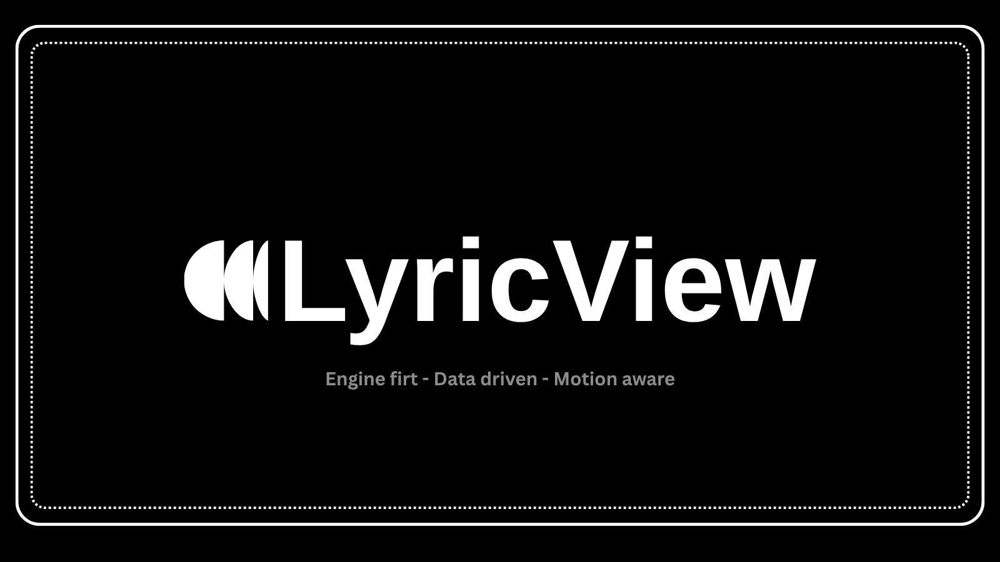

# LyricView

<p align="center">
  
</p>

LyricView is a reusable lyric engine and renderer for synchronized text experiences. It is designed around three principles:

- engine first: the timing and lyric logic is separated from the platform UI;
- data driven: lyrics become structured data instead of ad-hoc strings;
- motion aware: timing and interpolation come from the song timeline rather than CSS-only timing.

The project starts with a lightweight Tkinter preview, but the architecture is intentionally built to evolve toward richer web, audio, and custom rendering experiences without coupling the core to a single frontend.

## Architecture overview

```text
LyricView
├── Core Engine
├── Time Engine
├── Lyric Model
├── Parser System
├── Motion Engine
├── Renderer
├── Plugin System
├── Theme System
└── UI adapters
```

### Core responsibilities

- `LyricEngine` coordinates lifecycle, events, and song state.
- `TimeEngine` manages current time, playback rate, pause/resume, seek, and tick updates.
- lyric objects model `Song`, `Section`, `Line`, `Word`, and `Syllable`.
- parser registry handles text, LRC, and JSON inputs.
- motion primitives provide interpolation, easing, and smooth scroll behavior.
- renderer adapters consume the engine state and update views.

## Installation

```bash
python -m venv .venv
. .venv/bin/activate
python -m pip install -e .
```

## Quick start

```bash
python -m lyricview -test --file "lyric-test.txt"
```

Or with the CLI entry point:

```bash
lv -test --file "lyric-test.txt" --theme aurora
```

## Python usage

```python
from lyricview.core.engine import LyricEngine
from lyricview.model.lyrics import Song, Section, Line

song = Song(
    title="Demo",
    sections=[
        Section(lines=[
            Line(text="Hello world", start=0.0, end=1.0),
            Line(text="This is LyricView", start=1.0, end=2.5),
        ])
    ],
)

engine = LyricEngine(song=song)
engine.play()
engine.seek(1.2)
state = engine.tick()
print(state["visual"]["active_line_index"])
```

## Parsing support

The parser layer is registry-based, so new formats can be added without modifying the engine directly.

```python
from lyricview.core.engine import LyricEngine
from lyricview.parsers.registry import parse_lrc

engine = LyricEngine()
engine.register_parser("custom", lambda text: parse_lrc(text))
parsed = engine.parse("[00:01.00]Hello\n[00:02.00]World", parser_name="custom")
```

## Motion system

The motion layer exposes interpolation, easing, and auto-scroll control. This keeps motion deterministic and decoupled from the display technology.

## Accessibility

The project respects reduced-motion preferences:

- `LYRICVIEW_REDUCED_MOTION=true`
- `prefers-reduced-motion=1`

When active, the renderer reduces motion while preserving synchronization and functionality.

## Themes

Themes remain tokens and configuration, not rendering logic. This keeps them reusable and easier to extend.

## Roadmap

The long-term direction is to support:

- line / word / syllable timing
- karaoke-style progressive highlighting
- multi-renderer backends
- audio adapters
- animation presets and plugin-driven effects

## Project docs

- [CONTRIBUTING.md](CONTRIBUTING.md) — how to contribute and develop responsibly
- [SECURITY.md](SECURITY.md) — how to report vulnerabilities privately and responsibly
- [ROADMAP.md](ROADMAP.md) — roadmap and long-term direction
- [CHANGELOG.md](CHANGELOG.md) — release history and project updates
- [Docs/index.html](Docs/index.html) — static documentation site

## License

This project is licensed under the MIT License. See [LICENSE](LICENSE).

## Contributing

Contributions are welcome. Keep changes focused, architecture driven, and validated with tests. Prefer small, reviewable improvements over broad rewrites.

See [CONTRIBUTING.md](CONTRIBUTING.md) for the full guide.
